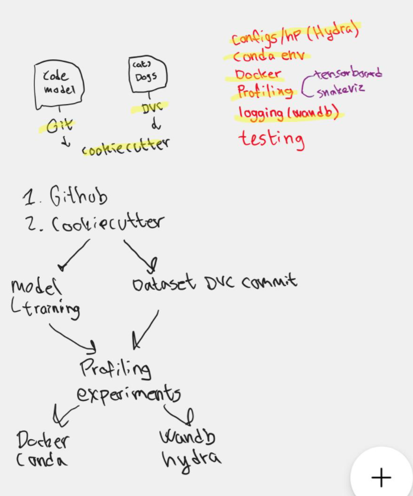

The project is done by 5 members: Abdulrahman Ramadan, Jakob Ryttergaard Poulsen, Cristina Ailoaei, Roza Hasso, Teakosheen Joulak

1. Dataset: Cats and Dogs image classification: https://www.kaggle.com/datasets/samuelcortinhas/cats-and-dogs-image-classification
which consists of 697 files/images of cats and dogs.

2. The  project goal:  The goal of the project is to classify a given image whether it includes a cat or a dog object, we want to create a structure repository to train a neural network model 
logging the results and the performance with reproducible  experiments. 

3. Framework: We are using Pytorch Image Models TIMM, because it includes the necessery classes and code for initializing the neural network model. 

4. Deep Learning Model:   We are using the Neural Network NN model to classify cats and dogs images

The tentative project plan is to use the following tools

## Code structure and versioning
Cookiecutter for a structured repository template
Git for version control of code
DVC for version control of data

## Reproducibility
Docker for system configuration
Conda for Python environment configuration

## Experiment logging and monitoring
Hydra for hyperparameter specification
Wandb for experiment logging and model performance

## Code performance and structure
Snakeviz for inspecting code performance
Using flake8 testing to check for Pep8 compliance in our code
Using isort for import structure

